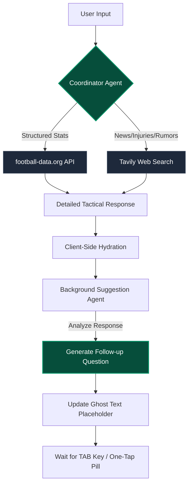

# 🤖 AI-Native Portfolio
### Built with [v0 by Vercel](https://v0.dev) & Next.js

This portfolio represents a shift in modern web development: 
**Generative UI**. Instead of writing boilerplate code from scratch, I collaborated with **v0** to architect a high-fidelity interface, then refined the logic using the Next.js App Router.

---

## ⚡ The Workflow
This project was developed using a rapid "Prompt-to-Production" cycle:
1. **Design:** Natural language prompting in **v0.dev** to generate the core UI.
2. **Refinement:** Iterative component styling using Tailwind CSS and **shadcn/ui**.
3. **Engineering:** Integration of local assets and logic refinement in **IntelliJ IDEA**.
4. **Deployment:** Hosted on **Vercel** with a custom domain and automated CI/CD.

---

## 🛠️ Tech Stack

* **UI Generation:** [v0.dev](https://v0.dev)
* **Framework:** [Next.js](https://nextjs.org/) (App Router)
* **Styling:** [Tailwind CSS](https://tailwindcss.com/)
* **Components:** [shadcn/ui](https://ui.shadcn.com/)
* **AI Integration:** Google Gemini API
* **Data Source:** football-data.org API
* **Package Manager:** `pnpm`
* **Deployment:** [Vercel](https://vercel.com)

---

## ⚽ Football AI Assistant

An autonomous, multi-agent sports intelligence platform. This system transcends traditional RAG (Retrieval-Augmented Generation) 
by implementing an autonomous decision-making layer that navigates between structured statistical schemas and unstructured live-web intelligence.

### 🔄 System Architecture
The assistant uses a decoupled agent strategy to ensure the UI remains snappy while the logic remains deep. This flow-state demonstrates how the **Coordinator** and **Suggestion** agents interact:



### 🧠 Core Performance Heuristics

* **Autonomous Tool Orchestration:** Implements dynamic tool selection logic. The agent evaluates the query's **temporal sensitivity**—routing historical or competition-specific queries to a structured API, while diverting rumor, injury, or tactical shift inquiries to a real-time web-crawling layer.

* **Predictive UX & Contextual Memory:** * **Vectorized Follow-ups:** Instead of basic "Who is next?" prompts, the Suggestion Agent utilizes the previous response's context to generate advanced inquiries (e.g., analyzing xG overperformance or defensive transition vulnerabilities).
   * **Heuristic Autocomplete:** A **"Ghost Text"** implementation utilizing the `append` pattern from the Vercel AI SDK, allowing for zero-friction navigation through complex tactical data.
  
* **Deterministic Persona Engineering:** Utilizes a highly disciplined system prompt architecture to enforce clinical, analytical output directly from the model inference. This eliminates conversational noise and ensures the agent consistently maintains a high-density, 
professional tactical tone without requiring post-inference filtering.

* **Multi-Model Resilience & Fallback:** Configured with a model hierarchy (**Gemini 2.0 Flash → 1.5 Pro**) to ensure high availability and sophisticated reasoning even during peak API latency.

---

### 📊 Technical Implementation Highlights

* **Logic Routing:** Built using the Vercel AI SDK's `streamText` with `maxSteps: 5` to allow for multi-stage tool calls and iterative reasoning loops.
* **State Management:** Intelligent syncing of local UI state (Ghost Text) with the AI SDK’s message history for seamless **"Tab-to-Send"** functionality and predictive placeholder updates.

---

## 🔍 Job Scout — AI Job Search Agent (Micro-Frontend)

A full-stack AI-powered job search agent deployed as a micro-frontend at `bengredev.com/ai-lab/job-search-agent`.

For full technical details, architecture, and implementation notes, see the dedicated repository:
👉 [thushanthbengre22-dev/job-search-agent](https://github.com/thushanthbengre22-dev/job-search-agent)

---

## ✨ Features

* **Responsive Design:** Fully optimized for mobile, tablet, and desktop.
* **Clean URLs:** Modern routing with and without the `#` hash, optimized for SEO.
* **Performance:** High Core Web Vitals scores via Next.js Image and font optimization.
* **Accessible UI:** Built with Radix UI primitives via shadcn for full keyboard/screen-reader support.

---

## 🚀 Local Development

Since this project uses **pnpm**, you can get it running locally on your Mac in seconds:

1. **Clone the repo:**
   ```bash
   git clone [https://github.com/thushanthbengre22-dev/portfolio-react-app.git](https://github.com/thushanthbengre22-dev/portfolio-react-app.git)
   
2. **Install dependencies:**
    ```bash
    pnpm install

3. **Set up Environment Variables:**
    Create a `.env.local` file in the root directory and add your API keys:
    ```env
    GOOGLE_API_KEY=your_gemini_api_key
    FOOTBALL_DATA_API_KEY=your_football_data_org_api_key
    ```

4. **Start the development server:**
    ```bash
    pnpm dev

5. **View the site:**

    Open [http://localhost:3000](http://localhost:3000) in your browser.
---

### 📬 Connect with Me

* **Portfolio:** [bengredev.com](https://bengredev.com)
* **LinkedIn:** [Thushanth Bengre](https://www.linkedin.com/in/thushanth-devananda-bengre/)
* **GitHub:** [@thushanthbengre22-dev](https://github.com/thushanthbengre22-dev)
